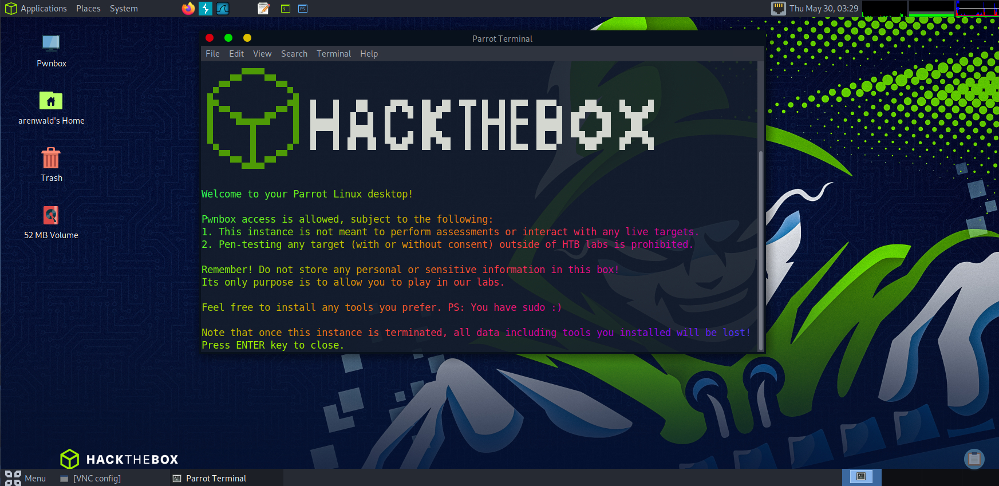

<div align="center">
  
  <h1>Pwnbox</h1>
    <br/>

  <p><i>Pwnbox is a customized, online Parrot Security Linux distribution with many hacking tools pre-installed. You can use it to play in our labs without installing a local VM serving the same purpose. <a href="https://help.hackthebox.com/en/articles/5185608-introduction-to-pwnbox">@HackTheBox</a>.</i></p>
  <br />
  <br />
  <br>
</div>

This repo contains Ansible playbooks to configure a Parrot OS HTB Edition VM to replicate the Pwnbox provided by HackTheBox.

Based on IppSec's customiaztions, I simply tweaked it and added configurations that I exported.

Tested with:   
- [ParrotOS HTB Edition version 5.3 Electro Ara](https://deb.parrot.sh/parrot/iso/5.3/Parrot-htb-5.3_amd64.iso.torrent)  

## Usage
Update/upgrade your packages first:  

`sudo apt update -y && sudo apt full-upgrade -y && sudo apt autoremove -y && sudo apt autoclean -y`

Then run:
```
git clone https://github.com/4renwald/pwnbox
cd pwnbox
sudo apt update
sudo apt install python3-venv -y
python3 -m venv pwnbox
source pwnbox/bin/activate
yes | pip3 install ansible pipx
ansible-playbook main.yml
```
